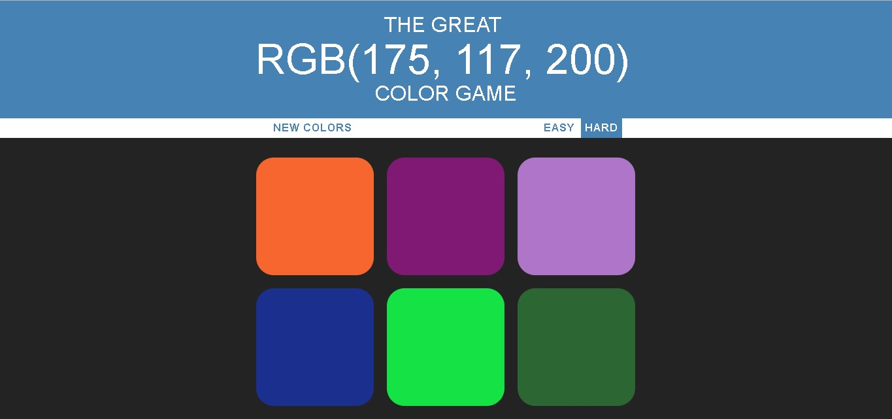

# color-game
Simple browser game made with html css and vanilla JS.
You are given an rgb value and you have to guess which of the squares contains the right color.
Dependig on the mode you choose you either have 3 or 6 squares to choose from.

This is not my original creation and was made as a part of Colt Steele's
"The Web Developer Bootcamp" course on Udemy https://www.udemy.com/the-web-developer-bootcamp/learn/ .

